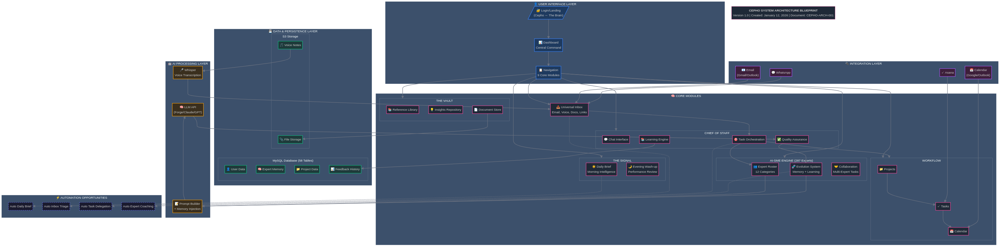

# CEPHO SYSTEM ARCHITECTURE BLUEPRINT

---

| **Document ID** | CEPHO-ARCH-001 |
|-----------------|----------------|
| **Version** | 1.0 |
| **Created** | January 12, 2026 |
| **Author** | Cepho System |
| **Status** | Draft - Pending Review |
| **Classification** | Internal - Confidential |

---

## Document Purpose

This document provides a comprehensive architectural overview of the Cepho platform, illustrating all system components, their interactions, data flows, and automation opportunities. It serves as the foundational reference for understanding how Cepho operates as an integrated intelligence system.

---

## Architecture Diagram



---

## System Layers

### 1. User Interface Layer

The entry point for all user interactions with Cepho.

| Component | Description | Status |
|-----------|-------------|--------|
| **Login/Landing** | Animated Cepho ↔ The Brain transition, authentication | ✅ Complete |
| **Dashboard** | Central command view with key metrics and quick actions | ✅ Complete |
| **Navigation** | 9-module sidebar for accessing all features | ✅ Complete |

### 2. Core Modules

The functional heart of Cepho, organised into five primary modules.

#### 2.1 The Signal
| Component | Function | Automation Potential |
|-----------|----------|---------------------|
| **Daily Brief** | Morning intelligence summary - tasks, priorities, insights | High - Auto-generate from calendar, inbox, tasks |
| **Evening Wash-up** | Performance review, expert feedback, tomorrow's priorities | High - Auto-summarise day's activities |

#### 2.2 Chief of Staff
| Component | Function | Automation Potential |
|-----------|----------|---------------------|
| **Chat Interface** | Natural language interaction with Chief of Staff | Active |
| **Task Orchestration** | Delegate tasks to appropriate AI-SMEs | High - Pattern-based auto-delegation |
| **Learning Engine** | Accumulate user preferences and patterns | Continuous |
| **Quality Assurance** | Review expert outputs before presenting | Medium - Rule-based filtering |

#### 2.3 AI-SME Engine (287 Experts)
| Component | Function | Automation Potential |
|-----------|----------|---------------------|
| **Expert Roster** | 287 experts across 12 categories | Reference data |
| **Evolution System** | Memory persistence, prompt improvement, corrections | High - Overnight coaching cycles |
| **Collaboration** | Multi-expert task coordination | Medium - Chief of Staff orchestrated |

#### 2.4 Workflow
| Component | Function | Automation Potential |
|-----------|----------|---------------------|
| **Projects** | Project tracking and organisation | Low - User-driven |
| **Tasks** | Task management with priorities and assignments | Medium - Auto-prioritisation |
| **Calendar** | Schedule management and availability | Medium - Smart scheduling |

#### 2.5 The Vault
| Component | Function | Automation Potential |
|-----------|----------|---------------------|
| **Reference Library** | Curated knowledge base | Low - User-curated |
| **Insights Repository** | Stored insights from expert interactions | High - Auto-extraction |
| **Document Store** | File management and organisation | Medium - Auto-categorisation |

#### 2.6 Universal Inbox
| Component | Function | Automation Potential |
|-----------|----------|---------------------|
| **Multi-source Intake** | Email, voice, documents, links, WhatsApp | High - Auto-triage and routing |

### 3. Data & Persistence Layer

| Component | Contents | Size |
|-----------|----------|------|
| **MySQL Database** | 58 tables covering users, experts, projects, feedback, evolution | Growing |
| **S3 Storage** | Files, voice notes, documents | Scalable |

**Key Tables:**
- User data and preferences
- Expert memory and conversation history
- Project and task data
- Feedback history for learning
- Expert evolution records

### 4. Integration Layer

| Integration | Status | Data Flow |
|-------------|--------|-----------|
| **Gmail** | OAuth Ready | Inbox → Universal Inbox |
| **Outlook** | OAuth Ready | Inbox → Universal Inbox |
| **Google Calendar** | OAuth Ready | Events ↔ Calendar |
| **Outlook Calendar** | OAuth Ready | Events ↔ Calendar |
| **Asana** | OAuth Ready | Tasks ↔ Workflow |
| **WhatsApp** | Planned | Messages → Universal Inbox |

### 5. AI Processing Layer

| Component | Function | Provider |
|-----------|----------|----------|
| **LLM API** | Core intelligence for all AI interactions | Forge (Claude/GPT) |
| **Prompt Builder** | Constructs expert prompts with memory injection | Internal |
| **Whisper** | Voice transcription for voice notes | OpenAI |

---

## Data Flow Patterns

### Morning Flow
```
Calendar + Tasks + Inbox → Chief of Staff → Daily Brief → User
```

### Expert Interaction Flow
```
User Query → Chief of Staff → Expert Selection → Prompt Builder (+ Memory) → LLM → QA Review → User
```

### Learning Flow
```
User Feedback → Feedback Store → Overnight Processing → Expert Prompt Updates
```

### Evening Flow
```
Day's Activities + Feedback → Chief of Staff → Evening Wash-up → User Review
```

---

## Automation Opportunities

| Opportunity | Current State | Target State | Priority |
|-------------|---------------|--------------|----------|
| **Auto Daily Brief** | Manual trigger | 7am auto-generation | High |
| **Auto Inbox Triage** | Manual review | AI categorisation + routing | High |
| **Auto Task Delegation** | User assigns | Chief of Staff recommends/assigns | Medium |
| **Auto Expert Coaching** | Manual feedback | Overnight improvement cycles | Medium |
| **Auto Insight Extraction** | Manual save | Auto-detect valuable insights | Low |

---

## Security & Governance

| Aspect | Implementation |
|--------|----------------|
| **Authentication** | OAuth 2.0 via Manus |
| **Data Encryption** | At rest and in transit |
| **Access Control** | User-scoped data isolation |
| **Audit Trail** | All interactions logged |

---

## Version History

| Version | Date | Changes | Author |
|---------|------|---------|--------|
| 1.0 | Jan 12, 2026 | Initial architecture document | Cepho System |

---

*This document is confidential and proprietary to Cepho. Unauthorised distribution is prohibited.*
