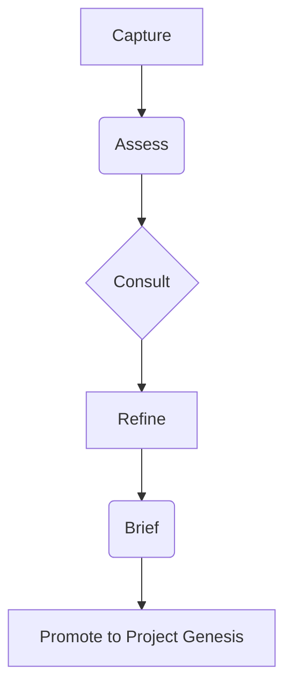

# Innovation Hub Process Plan

**Document Version:** 1.0  
**Last Updated:** February 25, 2026  
**Owner:** Manus AI  

## 1. Introduction

This document outlines the processes and workflows for the Innovation Hub within the CEPHO.AI platform. It details the stages of the Innovation Flywheel, from idea capture to promotion into Project Genesis, and serves as a guide for users and developers.

## 2. The Innovation Flywheel

The Innovation Hub is structured around a five-stage flywheel designed to systematically capture, evaluate, and develop ideas.

  <!-- Placeholder for a diagram -->

## 3. Flywheel Stages

### 3.1. Capture

**Objective:** To source and record new ideas from multiple channels.

**User Actions:**
- Manually submit an idea using the "Capture Idea" form.
- Analyze an article for opportunities using the "Analyze Article" feature.
- Generate new ideas based on trends using the "Generate Daily Ideas" button.

**Backend Processes:**
- `trpc.innovation.captureIdea`: Mutation to save a manually entered idea.
- `trpc.innovation.analyzeArticle`: Mutation to process a URL and extract opportunities.
- `trpc.innovation.generateDailyIdeas`: Mutation to generate ideas using an AI model.

### 3.2. Assess

**Objective:** To evaluate the strategic potential of captured ideas.

**User Actions:**
- Select an idea from the pipeline to view its details.
- Initiate an AI-powered assessment by clicking "Run Assessment".

**Backend Processes:**
- `trpc.innovation.getIdeaWithAssessments`: Query to fetch an idea and its associated assessments.
- `trpc.innovation.runAssessment`: Mutation to perform a strategic evaluation of an idea.

### 3.3. Consult

**Objective:** To gather feedback from subject matter experts (SMEs).

**User Actions:**
- Initiate a consultation by clicking "Consult with SMEs".

**Backend Processes:**
- (To be defined - likely involves the Expert Network)

### 3.4. Refine

**Objective:** To iterate on ideas based on assessments and feedback.

**User Actions:**
- Update idea details and description.

**Backend Processes:**
- (To be defined - likely an `updateIdea` mutation)

### 3.5. Brief

**Objective:** To create a concise, actionable summary of a validated idea.

**User Actions:**
- Generate a brief for a refined idea.
- Promote the idea to Project Genesis.

**Backend Processes:**
- `trpc.innovation.generateBrief`: Mutation to create an idea brief.
- `trpc.innovation.promoteToGenesis`: Mutation to transition the idea into the Project Genesis workflow.

## 4. Venture Development Framework Integration

The Innovation Hub serves as the first phase, "Ideation & Concept," of the broader six-phase venture development framework.

## 5. Process Flow Diagram

