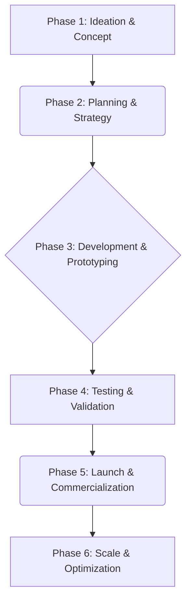

# Project Genesis Process Plan

**Document Version:** 1.0  
**Last Updated:** February 25, 2026  
**Owner:** Manus AI  

## 1. Introduction

This document outlines the processes and workflows for Project Genesis, the venture development framework within the CEPHO.AI platform. It details the six-phase process for taking a validated idea from concept to full-scale commercialization.

## 2. The 6-Phase Venture Development Framework

Project Genesis is structured around a six-phase framework that provides a comprehensive roadmap for venture development.

 <!-- Placeholder for a diagram -->

## 3. Framework Phases

### 3.1. Phase 1: Ideation & Concept

**Objective:** To generate and validate new venture ideas.

**Process:** This phase is handled by the **Innovation Hub**. See the *Innovation Hub Process Plan* for detailed workflows.

### 3.2. Phase 2: Planning & Strategy

**Objective:** To develop a comprehensive business plan and strategic roadmap.

**User Actions:**
- Initiate a new project from a promoted idea.
- Use the **Genesis Blueprint Wizard** to create a detailed business plan.

**Backend Processes:**
- `trpc.projectGenesis.initiate`: Mutation to create a new project from an idea.
- `trpc.projectGenesis.listProjects`: Query to fetch all active projects.

### 3.3. Phase 3: Development & Prototyping

**Objective:** To build a minimum viable product (MVP) or prototype.

**User Actions:**
- Assemble an expert team using the **Expert Team Assembly Wizard**.
- Manage development tasks and milestones.

**Backend Processes:**
- (To be defined - likely involves task management and team collaboration features)

### 3.4. Phase 4: Testing & Validation

**Objective:** To test the MVP with target users and validate market fit.

**User Actions:**
- Use the **Validation Engine** to conduct user testing and gather feedback.
- Track quality and performance with the **Blueprint QMS**.

**Backend Processes:**
- (To be defined - likely involves feedback collection and analysis tools)

### 3.5. Phase 5: Launch & Commercialization

**Objective:** To launch the product and begin commercialization efforts.

**User Actions:**
- Develop a go-to-market strategy.
- Create marketing materials using the **Social Media Blueprint** and **Presentation Blueprint**.

**Backend Processes:**
- (To be defined - likely involves marketing and sales automation tools)

### 3.6. Phase 6: Scale & Optimization

**Objective:** To scale the venture and optimize for growth.

**User Actions:**
- Monitor key performance indicators (KPIs).
- Continuously improve the product and processes.

**Backend Processes:**
- (To be defined - likely involves analytics and reporting tools)

## 4. Process Flow Diagram

