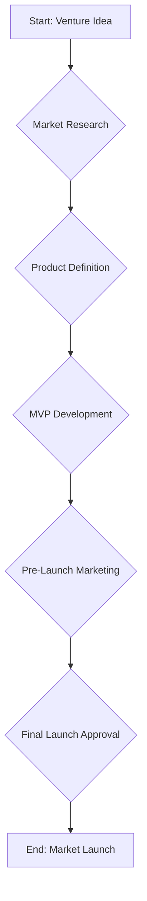

# Autonomous Workflows

Phase: 5
Status: Draft

## 1. Introduction

Autonomous Workflows are the core execution engine of Phase 5. They represent high-level, goal-oriented business processes that the Cepho AI Platform can execute from end to end. Unlike the more granular tasks of previous phases, a single workflow encapsulates a complex series of actions, decisions, and agent collaborations required to achieve a significant business outcome.

This document defines the structure, lifecycle, and management of these workflows.

## 2. Workflow Architecture

Each workflow is defined as a state machine, where each state represents a specific stage in the business process. The transitions between states are governed by a set of conditions, which can be the completion of a task, the output of an agent, or a human approval.

### 2.1. Key Concepts

- **Venture:** The top-level object representing the overall business goal (e.g., "Launch a new SaaS product"). Each venture has a primary workflow.
- **Workflow:** A directed graph of `Stages` designed to achieve the `Venture` goal.
- **Stage:** A specific phase within a workflow (e.g., `MarketResearch`, `ProductDevelopment`, `MarketingCampaign`).
- **Task:** A concrete action to be performed within a `Stage`, assigned to a specific agent (e.g., "Generate a list of 50 potential competitors").

### 2.2. Example Workflow: `NewVentureLaunch`

This workflow operationalizes the process of taking a new product idea to market.



## 3. Workflow Lifecycle

A workflow progresses through a defined lifecycle, managed by the Orchestrator.

1.  **Initiation:** A workflow is created and associated with a new `Venture`.
2.  **Execution:** The Orchestrator moves the workflow through its `Stages`, assigning `Tasks` to appropriate agents.
3.  **Suspension (Awaiting Gate):** The workflow pauses when it reaches a `HumanApprovalGate`, awaiting user input.
4.  **Resumption:** Upon receiving approval, the workflow resumes execution.
5.  **Completion:** The workflow concludes when it reaches its final state.
6.  **Termination:** The workflow can be halted prematurely by the user or by an unrecoverable error.

## 4. Data Model and API

### 4.1. Data Model: `Workflow`

```json
{
  "workflowId": "uuid",
  "ventureId": "uuid",
  "name": "NewVentureLaunch",
  "status": "running | suspended | completed | terminated",
  "currentStage": "MarketResearch",
  "history": [
    {
      "stage": "Start",
      "status": "completed",
      "completedAt": "timestamp"
    }
  ],
  "createdAt": "timestamp"
}
```

### 4.2. API Endpoint: `POST /api/v1/workflows`

- **Description:** Creates and initiates a new workflow for a given venture.
- **Request Body:**
  ```json
  {
    "ventureId": "uuid",
    "workflowTemplate": "NewVentureLaunch"
  }
  ```
- **Response:**
  - `201 Created`: Returns the newly created `Workflow` object.

---
