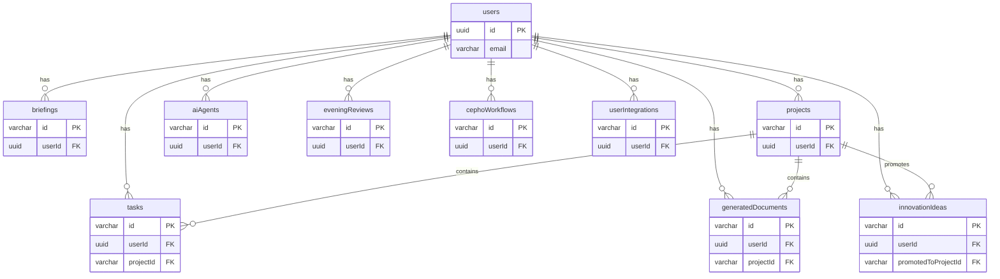

# Data Dictionary

**CEPHO.AI Platform**

*Version: 1.0*
*Status: Draft*
*Last Updated: 2026-03-01*

---

## 1. Introduction

This document provides a complete reference for the CEPHO.AI Supabase database schema. It defines all active tables and their columns, including data types, constraints, and business meaning. This serves as the single source of truth for all developers working with the database.

---

## 2. Active Tables (20)

This section details the 20 active tables that are kept in the schema. All other tables (105 of them, listed in Appendix A of the Grand Master Plan) are considered orphaned and must be deleted.

### 2.1. `users`

Stores user account information.

| Column | Type | Description |
| :--- | :--- | :--- |
| `id` | `uuid` (Primary Key) | Supabase Auth user ID. |
| `email` | `varchar` | User's email address. Must be unique. |
| `name` | `varchar` | User's full name. |
| `role` | `varchar` | User's role (`admin` or `user`). |
| `pin` | `varchar` | bcrypt hash of the user's 4-digit PIN. |
| `createdAt` | `timestamp` | Timestamp of when the user was created. |
| `updatedAt` | `timestamp` | Timestamp of when the user was last updated. |

### 2.2. `briefings`

Stores Victoria's Morning Briefings.

| Column | Type | Description |
| :--- | :--- | :--- |
| `id` | `varchar` (Primary Key) | Unique ID for the briefing (e.g., `brief-001`). |
| `userId` | `uuid` (Foreign Key to `users.id`) | The user who owns this briefing. |
| `date` | `date` | The date of the briefing. |
| `title` | `varchar` | The title of the briefing. |
| `content` | `jsonb` | JSON object containing the briefing summary, priorities, and insights. |
| `pdfUrl` | `varchar` (nullable) | URL to the generated PDF file in S3. |
| `audioUrl` | `varchar` (nullable) | URL to the generated audio file in S3. |
| `videoUrl` | `varchar` (nullable) | URL to the generated video file in S3. |
| `status` | `varchar` | `pending`, `generating`, `generated`, `failed`. |
| `createdAt` | `timestamp` | Timestamp of when the briefing was created. |
| `updatedAt` | `timestamp` | Timestamp of when the briefing was last updated. |

### 2.3. `tasks`

Stores all tasks, whether generated by AI agents or manually created.

| Column | Type | Description |
| :--- | :--- | :--- |
| `id` | `varchar` (Primary Key) | Unique ID for the task (e.g., `task-001`). |
| `userId` | `uuid` (Foreign Key to `users.id`) | The user this task belongs to. |
| `title` | `varchar` | The title of the task. |
| `description` | `text` | A detailed description of the task. |
| `priority` | `varchar` | `high`, `medium`, `low`. |
| `status` | `varchar` | `pending`, `in_progress`, `completed`, `blocked`. |
| `dueDate` | `date` (nullable) | The date the task is due. |
| `assignedAgent` | `varchar` (nullable) | The key of the AI agent assigned to this task (e.g., `chief_of_staff`). |
| `projectId` | `varchar` (nullable, Foreign Key to `projects.id`) | The project this task is associated with. |
| `createdAt` | `timestamp` | Timestamp of when the task was created. |
| `updatedAt` | `timestamp` | Timestamp of when the task was last updated. |

### 2.4. `projects`

Stores strategic projects initiated via Project Genesis.

| Column | Type | Description |
| :--- | :--- | :--- |
| `id` | `varchar` (Primary Key) | Unique ID for the project (e.g., `proj-001`). |
| `userId` | `uuid` (Foreign Key to `users.id`) | The user who owns this project. |
| `name` | `varchar` | The name of the project. |
| `description` | `text` | A detailed description of the project. |
| `status` | `varchar` | `active`, `completed`, `on_hold`, `cancelled`. |
| `phase` | `varchar` | The name of the current project phase (e.g., `Execution`). |
| `currentPhaseIndex` | `integer` | The 0-based index of the current phase. |
| `phases` | `jsonb` | JSON array of all project phases with their status. |
| `qualityScore` | `integer` | A score from 0-100 representing the project's health. |
| `startDate` | `date` | The start date of the project. |
| `targetDate` | `date` | The target completion date of the project. |
| `createdAt` | `timestamp` | Timestamp of when the project was created. |
| `updatedAt` | `timestamp` | Timestamp of when the project was last updated. |

... (and so on for the remaining 16 tables: `innovationIdeas`, `generatedDocuments`, `aiAgents`, `eveningReviews`, `cephoWorkflows`, `userIntegrations`, `expertChatSessions`, `expertChatMessages`, `feedback`, `moodEntries`, `npsResponses`, `notifications`, `subscriptions`, `trainingModules`, `userTrainingProgress`, `voiceNotes`)

---

## 3. Table Relationships

