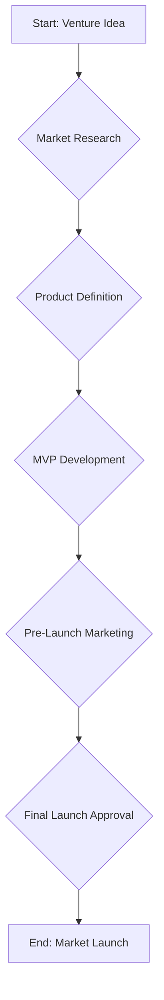

# Phase 5 Overview
Phase: 5
Status: Draft

## 1. Introduction

Phase 5 marks a strategic evolution of the Cepho AI Platform, transitioning from a suite of powerful productivity tools into a fully autonomous venture execution system. Where prior phases focused on building the foundational platform and enhancing user capabilities, Phase 5 is designed to orchestrate these capabilities to achieve complex, end-to-end business objectives with minimal human intervention.

This phase operationalizes the founder story into a repeatable system design, defining the architecture and processes required for the platform to independently manage and execute the entire lifecycle of a new business venture, from initial conception to market launch.

## 2. Core Objectives

The primary goal of Phase 5 is to deliver a system capable of autonomous venture execution. This is broken down into the following core objectives:

| Objective | Description |
|---|---|
| **Enable End-to-End Autonomy** | Develop a system of autonomous workflows that can execute complex, multi-step business processes, such as product development, marketing campaigns, and customer acquisition funnels. |
| **Orchestrate Specialized Agents** | Implement a sophisticated model for orchestrating a variety of specialized AI agents, each responsible for specific tasks like market research, content creation, or code generation. |
| **Ensure Human Oversight and Control** | Design and integrate a system of mandatory human approval gates at critical decision points, ensuring that the user retains ultimate control and authority over the venture's direction. |
| **Integrate with Real-World Services** | Build a robust integration layer that allows the platform to interact with essential third-party services, such as payment gateways, advertising platforms, and legal service providers. |
| **Automate Market Launch Processes** | Create a dedicated workflow for automating the entire market launch sequence, from final pre-launch checks to public announcements and initial customer onboarding. |

## 3. Key Architectural Components

To achieve these objectives, Phase 5 is structured around several key architectural and conceptual components. Each of these components is detailed in a dedicated design document within this package.

## 4. Scope and Boundaries

- **In Scope:** The design and documentation of the complete autonomous execution framework. This includes data models, API contracts, workflow diagrams, and interaction protocols.
- **Out of Scope:** The implementation of production-level code. Phase 5 is strictly a design and documentation phase. All previous phases (1-4) are considered complete and locked.

## 5. Handover to Phase 6

The successful completion of Phase 5 will result in a comprehensive design package. This package will serve as the foundational blueprint for Phase 6, which will focus on the commercialization, scaling, and enterprise deployment of the Cepho AI Platform.

---
--- FILE_SEPARATOR
# Autonomous Workflows
Phase: 5
Status: Draft

## 1. Introduction

Autonomous Workflows are the core execution engine of Phase 5. They represent high-level, goal-oriented business processes that the Cepho AI Platform can execute from end to end. Unlike the more granular tasks of previous phases, a single workflow encapsulates a complex series of actions, decisions, and agent collaborations required to achieve a significant business outcome.

This document defines the structure, lifecycle, and management of these workflows.

## 2. Workflow Architecture

Each workflow is defined as a state machine, where each state represents a specific stage in the business process. The transitions between states are governed by a set of conditions, which can be the completion of a task, the output of an agent, or a human approval.

### 2.1. Key Concepts

- **Venture:** The top-level object representing the overall business goal (e.g., "Launch a new SaaS product"). Each venture has a primary workflow.
- **Workflow:** A directed graph of `Stages` designed to achieve the `Venture` goal.
- **Stage:** A specific phase within a workflow (e.g., `MarketResearch`, `ProductDevelopment`, `MarketingCampaign`).
- **Task:** A concrete action to be performed within a `Stage`, assigned to a specific agent (e.g., "Generate a list of 50 potential competitors").

### 2.2. Example Workflow: `NewVentureLaunch`

This workflow operationalizes the process of taking a new product idea to market.



## 3. Workflow Lifecycle

A workflow progresses through a defined lifecycle, managed by the Orchestrator.

1.  **Initiation:** A workflow is created and associated with a new `Venture`.
2.  **Execution:** The Orchestrator moves the workflow through its `Stages`, assigning `Tasks` to appropriate agents.
3.  **Suspension (Awaiting Gate):** The workflow pauses when it reaches a `HumanApprovalGate`, awaiting user input.
4.  **Resumption:** Upon receiving approval, the workflow resumes execution.
5.  **Completion:** The workflow concludes when it reaches its final state.
6.  **Termination:** The workflow can be halted prematurely by the user or by an unrecoverable error.

## 4. Data Model and API

### 4.1. Data Model: `Workflow`

```json
{
  "workflowId": "uuid",
  "ventureId": "uuid",
  "name": "NewVentureLaunch",
  "status": "running | suspended | completed | terminated",
  "currentStage": "MarketResearch",
  "history": [
    {
      "stage": "Start",
      "status": "completed",
      "completedAt": "timestamp"
    }
  ],
  "createdAt": "timestamp"
}
```

### 4.2. API Endpoint: `POST /api/v1/workflows`

- **Description:** Creates and initiates a new workflow for a given venture.
- **Request Body:**
    ```json
    {
      "ventureId": "uuid",
      "workflowTemplate": "NewVentureLaunch"
    }
    ```
- **Response:**
    - `201 Created`: Returns the newly created `Workflow` object.

---
--- FILE_SEPARATOR
# Agent Orchestration Model
Phase: 5
Status: Draft

## 1. Introduction

The Agent Orchestration Model defines how the Cepho AI Platform manages, tasks, and coordinates a diverse ecosystem of specialized AI agents. This model moves beyond the single-agent paradigm, creating a collaborative environment where multiple agents work in concert to execute the complex `Tasks` defined within an `Autonomous Workflow`.

The central component of this model is the **Orchestrator**.

## 2. The Orchestrator

The Orchestrator is a master agent responsible for the high-level execution of a `Workflow`. It does not perform business tasks itself; instead, it interprets the workflow, assigns tasks to specialized agents, and monitors their progress.

### 2.1. Core Responsibilities

- **Task Decomposition:** Breaking down a high-level `Stage` from a workflow (e.g., `Market Research`) into a series of concrete, actionable `Tasks`.
- **Agent Selection:** Identifying the most appropriate agent from the available pool to perform each `Task` (e.g., selecting the `MarketAnalysisAgent` for a competitor research task).
- **Task Assignment & Monitoring:** Dispatching tasks to the selected agents and monitoring their status (`pending`, `running`, `completed`, `failed`).
- **State Management:** Updating the overall `Workflow` status based on the completion of individual tasks and stages.
- **Error Handling:** Managing task failures, retrying where appropriate, or escalating to the user for intervention.

## 3. The Agent Ecosystem

The platform includes a variety of specialized agents, each optimized for a specific domain or function. These agents are stateless and operate on a task-in, result-out basis.

### 3.1. Agent Categories

| Category | Example Agents | Function |
|---|---|---|
| **Research & Analysis** | `MarketAnalysisAgent`, `FinancialModelingAgent` | Gathers and synthesizes information, creates reports, and builds predictive models. |
| **Content & Creative** | `CopywritingAgent`, `GraphicDesignAgent` | Generates written and visual content for marketing, product, and communications. |
| **Software Development** | `CodeGenerationAgent`, `DatabaseAdminAgent` | Writes, tests, and deploys code; manages database schemas and infrastructure. |
| **Marketing & Sales** | `SEMAgent`, `SocialMediaAgent` | Manages advertising campaigns, social media presence, and lead generation funnels. |
| **External Integration** | `StripeIntegrationAgent`, `AWSIntegrationAgent` | Interacts with third-party APIs to perform real-world actions like processing payments or provisioning servers. |

## 4. Communication and Data Flow

Agents do not communicate directly with each other. All communication is mediated by the Orchestrator to ensure a clear chain of command and an auditable data trail.

1.  **Orchestrator to Agent:** The Orchestrator dispatches a `Task` to an agent. The task object contains all the necessary context and data for the agent to perform its function.
2.  **Agent to Orchestrator:** Upon completion, the agent returns a `Result` object to the Orchestrator. The result object includes the output of the task and a status code.
3.  **Data Persistence:** The Orchestrator is responsible for persisting all `Task` and `Result` objects to the database, creating a complete historical record of the workflow execution.

## 5. Data Models

### 5.1. Data Model: `Task`

```json
{
  "taskId": "uuid",
  "workflowId": "uuid",
  "stage": "MarketResearch",
  "assignedAgent": "MarketAnalysisAgent",
  "status": "running",
  "prompt": "Analyze the top 5 competitors for a SaaS product in the project management space.",
  "context": { ... },
  "createdAt": "timestamp"
}
```

### 5.2. Data Model: `Result`

```json
{
  "resultId": "uuid",
  "taskId": "uuid",
  "status": "completed",
  "output": {
    "reportUrl": "/path/to/competitor_analysis.md"
  },
  "completedAt": "timestamp"
}
```

---
--- FILE_SEPARATOR
# Human Approval Gates
Phase: 5
Status: Draft

## 1. Introduction

Human Approval Gates are a critical component of the Phase 5 architecture, serving as the primary mechanism for ensuring user control and oversight. These gates are mandatory, non-bypassable checkpoints within an `Autonomous Workflow` where the system must halt and receive explicit confirmation from the user before proceeding.

This design ensures that while the platform can execute complex tasks autonomously, all strategic decisions and high-stakes actions remain under the ultimate authority of the human user.

## 2. Gate Definition and Placement

Gates are defined within the workflow templates and are strategically placed before any action that is:

-   **Irreversible:** Such as sending a mass email, making a public announcement, or deleting a large amount of data.
-   **High-Cost:** Involving significant financial expenditure, such as launching a large-scale advertising campaign.
-   **Strategically Significant:** Defining the direction of the venture, such as approving the final product design or confirming a pivot in marketing strategy.
-   **Legally Binding:** Such as agreeing to the terms of service for a new software tool or generating a formal legal document.

### 2.1. Example Gates in the `NewVentureLaunch` Workflow

-   **Gate:** `Approve Final Product Definition`
-   **Gate:** `Approve MVP Budget and Timeline`
-   **Gate:** `Approve Final Brand Identity and Marketing Copy`
-   **Gate:** `Final Launch Approval`

## 3. The Approval Process

1.  **Workflow Suspension:** When a workflow reaches a gate, the Orchestrator changes the workflow status to `suspended` and creates a new `ApprovalRequest` object.
2.  **User Notification:** The user is notified via their preferred channel (e.g., email, push notification) that their approval is required.
3.  **Review and Decision:** The user is presented with a clear, concise summary of the decision being requested, including all relevant context and pre-computed outcomes. The user can `Approve` or `Reject` the request.
4.  **Workflow Resumption/Termination:**
    -   On `Approve`, the `ApprovalRequest` is marked as `approved`, and the Orchestrator resumes the workflow.
    -   On `Reject`, the `ApprovalRequest` is marked as `rejected`, and the Orchestrator terminates the workflow, flagging it for manual review.

## 4. The Approval Request UI

The user interface for an approval request is designed for clarity and decisive action. It must contain:

-   **A clear question:** e.g., "Do you approve the launch of the marketing campaign with a budget of $10,000?"
-   **A summary of the context:** Key data and reports that led to this decision point.
-   **A preview of the outcome:** What will happen immediately after approval (e.g., "The campaign will go live on Google and Facebook.").
-   **Explicit `Approve` and `Reject` buttons.**

## 5. Data Model and API

### 5.1. Data Model: `ApprovalRequest`

```json
{
  "approvalId": "uuid",
  "workflowId": "uuid",
  "gateName": "Final Launch Approval",
  "status": "pending | approved | rejected",
  "requestSummary": "Approve the launch of the new SaaS product...",
  "contextDocs": [
    "/path/to/final_checklist.md"
  ],
  "requestedBy": "Orchestrator",
  "createdAt": "timestamp",
  "resolvedAt": "timestamp",
  "resolvedBy": "user_id"
}
```

### 5.2. API Endpoint: `POST /api/v1/approvals/{approvalId}/decision`

- **Description:** Allows the user to submit their decision for a pending approval request.
- **Request Body:**
    ```json
    {
      "decision": "approved" // or "rejected"
    }
    ```
- **Response:**
    - `200 OK`: If the decision is successfully recorded.

---
--- FILE_SEPARATOR
# Real-World Integration Layer
Phase: 5
Status: Draft

## 1. Introduction

The Real-World Integration Layer is the architectural component that enables the Cepho AI Platform to interact with external, third-party services. It acts as a bridge between the platform's internal, autonomous agents and the APIs of external systems, allowing the platform to perform tangible, real-world actions.

This layer is essential for moving beyond data processing and content generation into true venture execution, such as processing payments, registering domain names, or running advertising campaigns.

## 2. Architectural Design

The integration layer is designed as a set of standardized adapters, where each adapter is responsible for communicating with a specific third-party API. This approach decouples the core logic of the autonomous agents from the specific implementation details of any given external service.

### 2.1. Key Components

- **Integration Agent:** A specialized type of agent (e.g., `StripeIntegrationAgent`) that exposes a set of standardized methods (e.g., `create_charge`, `refund_payment`).
- **Adapter:** The internal logic within the Integration Agent that handles the specifics of the third-party API, including authentication, endpoint URLs, and data transformation.
- **Credentials Vault:** A secure, encrypted storage system for all third-party API keys and access tokens. The Orchestrator retrieves credentials from the vault at runtime and injects them into the appropriate Integration Agent.

### 2.2. Interaction Flow

1.  The `Orchestrator` assigns a task requiring real-world action (e.g., "Charge customer for new subscription") to the appropriate `IntegrationAgent` (e.g., `StripeIntegrationAgent`).
2.  The `Orchestrator` retrieves the necessary API key from the `CredentialsVault`.
3.  The `IntegrationAgent` receives the task and the credentials.
4.  The agent's internal `Adapter` translates the standardized task into a specific API call to the external service (e.g., a `POST` request to `api.stripe.com/v1/charges`).
5.  The `Adapter` handles the response from the external API, transforming it back into a standardized `Result` object, which is then returned to the `Orchestrator`.

## 3. Supported Integrations

Phase 5 will prioritize the development of adapters for a core set of services essential for launching and operating a digital venture.

| Category | Service | Key Actions |
|---|---|---|
| **Payments** | Stripe | Process credit card charges, manage subscriptions, handle refunds. |
| **Cloud Infrastructure** | Amazon Web Services (AWS) | Provision servers (EC2), manage databases (RDS), host static assets (S3). |
| **Domain & DNS** | GoDaddy, Namecheap | Register new domain names, update DNS records. |
| **Digital Advertising** | Google Ads, Facebook Ads | Create and manage ad campaigns, monitor performance and spend. |
| **Legal Services** | Clerky, Stripe Atlas | Company formation, generation of standard legal documents (e.g., privacy policy). |

## 4. API and Data Model

### 4.1. Data Model: `Integration`

This model stores the configuration and state for each user-connected third-party service.

```json
{
  "integrationId": "uuid",
  "userId": "uuid",
  "provider": "stripe",
  "status": "active | inactive | error",
  "credentialsVaultKey": "path/to/stripe/api_key",
  "metadata": {
    "accountId": "acct_12345"
  },
  "createdAt": "timestamp"
}
```

### 4.2. API Endpoint: `POST /api/v1/integrations`

- **Description:** Connects a new third-party service to the user's account.
- **Request Body:**
    ```json
    {
      "provider": "stripe",
      "apiKey": "sk_test_..."
    }
    ```
- **Response:**
    - `201 Created`: Returns the new `Integration` object.

---
--- FILE_SEPARATOR
# Market Launch Automation
Phase: 5
Status: Draft

## 1. Introduction

The Market Launch Automation workflow is a specialized, high-stakes autonomous process designed to orchestrate the final sequence of actions required to launch a new venture. This workflow acts as the final execution arm of a `Venture` plan, triggered only after all preceding development, marketing, and legal workflows have been completed and have received final human approval.

Its purpose is to ensure a coordinated, error-free, and simultaneous activation of all public-facing assets and services, transforming the venture from a pre-launch state to being live and operational in the market.

## 2. Workflow Trigger and Pre-conditions

- **Trigger:** The `Market Launch` workflow is initiated when the parent `Venture` object's state is moved to `ReadyForLaunch`. This state change can only occur after the `Final Launch Approval` gate has been signed off by the user.
- **Pre-conditions:**
    1.  All assets (website, app, marketing materials) must be deployed to production staging environments.
    2.  All required third-party service accounts (e.g., Stripe, social media, analytics) must be configured and their API keys stored securely in the platform's vault.
    3.  The DNS provider integration must be active and have the necessary permissions to update records.
    4.  The customer support channels (e.g., email, chat widget) must be configured and ready to receive inquiries.

## 3. The Launch Sequence

The launch sequence is a strictly ordered, non-parallel series of steps. Each step must complete successfully before the next one begins. If any step fails, the workflow halts and immediately triggers an alert for human intervention.

| Step | Action | Service/Agent Involved | Verification | Rollback Procedure |
|---|---|---|---|---|
| 1 | **Final System Health Check** | `MonitoringAgent` | Runs a full diagnostic on all production infrastructure (servers, databases, APIs) to ensure they are operational and healthy. | N/A (Halts on failure) |
| 2 | **Activate Payment Gateway** | `StripeIntegration` | Switches the Stripe account from "test" to "live" mode. | Manually switch back to "test" mode in the Stripe dashboard. |
| 3 | **Update DNS Records** | `DNSProviderIntegration` | Points the primary domain and subdomains from any holding pages to the live production servers. | Revert DNS records to their previous state. |
| 4 | **Enable Public Sign-ups** | `UserManagementService` | Toggles the feature flag that allows new users to register for the service. | Disable the public sign-up feature flag. |
| 5 | **Publish Social Media Announcements** | `SocialMediaAgent` | Pushes the pre-approved launch announcements to all connected social media accounts (Twitter, LinkedIn, etc.). | Manually delete the published posts from each platform. |
| 6 | **Send Launch Email** | `EmailMarketingIntegration` | Sends the official launch announcement email to the pre-built mailing list. | N/A (Cannot be undone) |
| 7 | **Activate Analytics Tracking** | `AnalyticsIntegration` | Enables live analytics tracking and event monitoring (e.g., Google Analytics, Mixpanel). | Disable tracking scripts via the integration settings. |
| 8 | **Notify Support Team** | `InternalCommsAgent` | Sends a high-priority notification to the designated customer support channel (e.g., Slack, Teams) that the venture is live. | Send a follow-up message clarifying the status. |

## 4. Post-Launch Monitoring

Immediately following the completion of the launch sequence, the workflow transitions into a post-launch monitoring state for a period of 24 hours.

- **`RealtimeAnalyticsAgent`**: Continuously monitors key launch metrics (e.g., website traffic, sign-up rates, error rates) against predefined thresholds.
- **`UptimeMonitoringAgent`**: Performs high-frequency checks on all public-facing endpoints to ensure availability.

If any metric deviates significantly from expectations or if any service becomes unavailable, an alert is immediately raised to the user and the designated operations team.

## 5. API and Data Model Contracts

### 5.1. Data Model: `LaunchChecklist`

This object tracks the state of the automated launch sequence.

```json
{
  "launchId": "uuid",
  "ventureId": "uuid",
  "status": "pending | in_progress | completed | failed",
  "steps": [
    {
      "stepName": "Final System Health Check",
      "status": "completed",
      "completedAt": "timestamp"
    },
    {
      "stepName": "Activate Payment Gateway",
      "status": "in_progress",
      "startedAt": "timestamp"
    }
    // ... other steps
  ],
  "createdAt": "timestamp",
  "updatedAt": "timestamp"
}
```

### 5.2. API Endpoint: `POST /api/v1/ventures/{ventureId}/launch`

- **Description:** Manually triggers the market launch workflow. This endpoint is protected and can only be called by the system itself after the final approval gate is passed.
- **Request Body:** (empty)
- **Response:**
    - `202 Accepted`: If the launch workflow is successfully initiated.
    - `412 Precondition Failed`: If any of the pre-launch conditions are not met.

---
--- FILE_SEPARATOR
# Ethics, Safety, and Guardrails
Phase: 5
Status: Draft

## 1. Guiding Principles

The capacity for autonomous action requires an unwavering commitment to ethical conduct and robust safety protocols. The design of the Cepho AI Platform’s autonomous systems is governed by a set of core principles that prioritize user well-being, transparency, and accountability above all else.

- **Human-in-Control:** The user is the ultimate authority. The platform is a tool to execute the user’s will, not to supplant it. All autonomous actions are performed on behalf of the user and are subject to their explicit or implicit approval.
- **Transparency of Action:** The platform must maintain a clear, auditable log of all significant actions taken, decisions made, and data accessed by its autonomous agents. The user must be able to understand *why* the system took a particular action.
- **Safety by Design:** Safety is not an add-on; it is a fundamental component of the architecture. The system is designed with multiple layers of technical and procedural guardrails to prevent unintended or harmful outcomes.
- **Privacy and Confidentiality:** The platform must treat all user data with the highest level of confidentiality, employing strong encryption and strict access controls to protect sensitive information.

## 2. The Three Layers of Safety

Safety is implemented through a three-layered model, providing redundancy and defense-in-depth against potential failures or misuse.

### Layer 1: Technical Guardrails (The Code)

This layer consists of hard-coded limitations and automated checks built directly into the platform’s architecture.

| Guardrail | Description |
|---|---|
| **Resource Consumption Limits** | Each agent and workflow is subject to strict, configurable limits on resource consumption, including API calls, compute time, and data storage. This prevents runaway processes from incurring unexpected costs or overloading systems. |
| **Action Sandboxing** | Potentially destructive actions, such as file deletion or database modification, are executed in an isolated “sandbox” environment first. The outcome is verified before being committed to the live production system. |
| **Rate Limiting** | All interactions with external APIs are subject to rate limiting to prevent the platform from being blacklisted or throttled by third-party services. |
| **Input/Output Validation** | All data passing between agents or across system boundaries is rigorously validated against a predefined schema. This prevents malformed data from causing downstream errors. |

### Layer 2: Procedural Guardrails (The Workflow)

This layer defines the rules and logic embedded within the autonomous workflows themselves.

| Guardrail | Description |
|---|---|
| **Mandatory Human Approval Gates** | Workflows are explicitly designed to halt at critical junctures and await explicit user confirmation before proceeding. This is the most important procedural safeguard. |
| **Pre-computation of High-Stakes Actions** | For irreversible actions, such as sending a mass email or making a public announcement, the exact content and target audience are pre-computed and presented to the user for approval long before the action is executed. |
| **Red Team Simulation** | Before deploying new autonomous workflows, a dedicated “Red Team” of agents attempts to find and exploit potential loopholes or failure modes in a simulated environment. |
| **Phased Rollout** | New or updated autonomous capabilities are rolled out incrementally, starting with a small group of internal users, to monitor for any unexpected behavior before a general release. |

### Layer 3: Operational Guardrails (The Human Element)

This layer involves the human oversight and operational procedures that surround the platform.

| Guardrail | Description |
|---|---|
| **Comprehensive Audit Logs** | The platform generates immutable, human-readable audit logs for all significant autonomous actions. These logs are reviewed regularly by a human compliance officer. |
| **Real-time Alerting** | A dedicated monitoring system tracks the health and behavior of the autonomous agents. Any deviation from expected parameters triggers an immediate alert to the user and the operations team. |
| **The “Big Red Button”** | A master kill switch is available to authorized administrators, allowing for an immediate, system-wide halt of all autonomous activity in the event of a critical emergency. |
| **Regular Ethics and Safety Reviews** | A standing committee of internal and external experts convenes on a quarterly basis to review the platform’s autonomous capabilities, audit logs, and safety procedures, recommending improvements and updates. |

## 3. Data Privacy and Confidentiality

- **Encryption:** All user data, both at rest and in transit, is encrypted using industry-standard AES-256 encryption.
- **Access Control:** A strict, role-based access control (RBAC) model ensures that agents and internal services only have access to the specific data required to perform their designated tasks.
- **Data Minimization:** The platform is designed to only collect and store the minimum amount of data necessary for its operation.

---
--- FILE_SEPARATOR
# Handover to Phase 6
Phase: 5
Status: Draft

## 1. Introduction

This document serves as the official handover from the Phase 5 Design Team to the Phase 6 Commercialization and Implementation Team. It summarizes the key architectural decisions, strategic rationale, and implementation priorities that should guide the development of the autonomous venture execution capabilities of the Cepho AI Platform.

The goal of Phase 5 was to create a comprehensive and robust design blueprint. Phase 6 is where this blueprint will be translated into production-ready code.

## 2. Architectural Summary

The Phase 5 architecture is designed around a modular, agent-based system governed by a central Orchestrator. This design provides a clear separation of concerns and allows for the independent development and scaling of different components.

**Key Pillars of the Architecture:**
- **Autonomous Workflows:** High-level state machines that define business processes.
- **Agent Orchestration:** A central Orchestrator that decomposes workflows into tasks and assigns them to specialized agents.
- **Human-in-the-Loop:** A non-negotiable system of approval gates that ensures human oversight of all critical decisions.
- **Real-World Integration:** A standardized adapter layer for interacting with external third-party services.

## 3. Implementation Priorities

While the entire design is important, a phased implementation is recommended to manage complexity and deliver value incrementally. The following implementation order is suggested for the Phase 6 team.

### Priority 1: The Core Orchestration Engine

- **Focus:** Build the `Orchestrator`, the data models for `Workflow`, `Task`, and `Result`, and a basic `Agent` class.
- **Rationale:** This is the heart of the autonomous system. Without it, no other component can function.

### Priority 2: Human Approval Gates

- **Focus:** Implement the `ApprovalRequest` data model and the UI/API for presenting and processing user decisions.
- **Rationale:** This is the most critical safety feature. It must be in place before any truly autonomous action is allowed to occur.

### Priority 3: The Integration Layer

- **Focus:** Develop the `CredentialsVault` and the initial set of high-priority integration adapters (e.g., Stripe, AWS).
- **Rationale:** This unlocks the platform’s ability to perform its first real-world actions and demonstrates immediate tangible value.

### Priority 4: The Full Agent Ecosystem

- **Focus:** Develop the full suite of specialized agents for research, content creation, marketing, etc.
- **Rationale:** This can be parallelized. Different teams can work on different agents simultaneously once the core orchestration engine is stable.

## 4. Key Risks and Considerations for Phase 6

- **API Stability:** The design assumes the stability of third-party APIs. The implementation team must build robust error handling and versioning strategies for the integration adapters.
- **Scalability:** The Orchestrator has the potential to become a bottleneck. The implementation should be designed with horizontal scaling in mind.
- **User Experience:** The success of the human approval gates depends on a clear, intuitive, and responsive user interface. Significant attention should be paid to the UX design of the approval workflow.

## 5. Final Checklist for Handover

- [ ] All Phase 5 design documents have been reviewed and approved.
- [ ] Data models have been formally specified and are ready for database implementation.
- [ ] API contracts have been defined and are ready for service implementation.
- [ ] The Phase 6 team has reviewed the implementation priorities and the key risks.

This concludes the design phase for autonomous venture execution. The system is now ready to be built.

---
